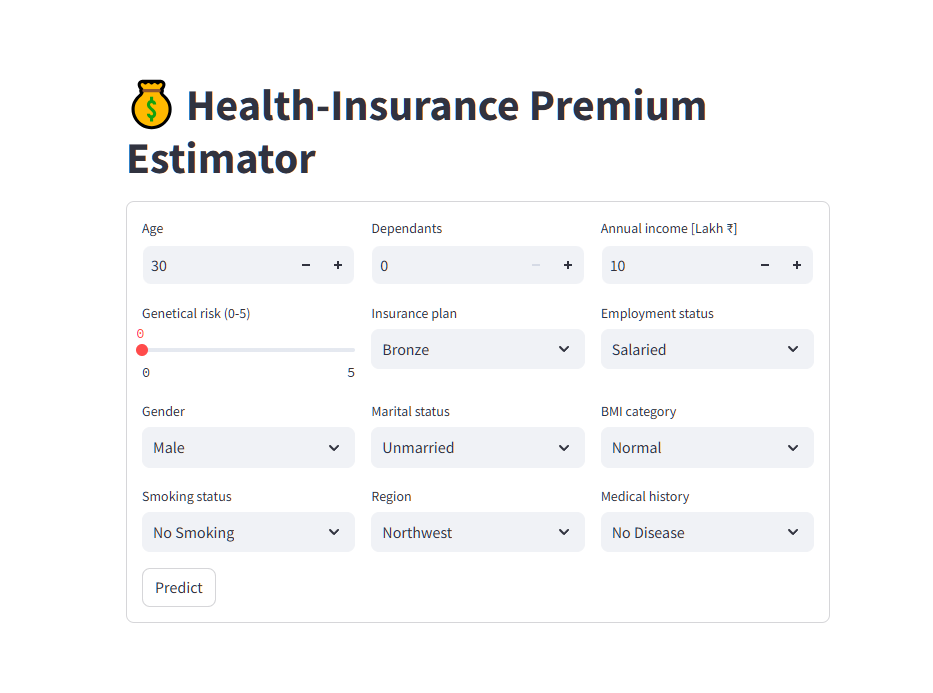
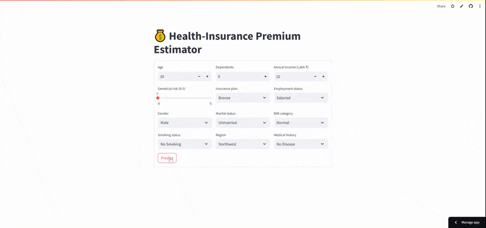

# 💰 Health-Insurance Premium Estimator

<p align="center">
  
  <br>
  <a href="https://health-insurance-model-hm-portfolio.streamlit.app">
    
  </a>
  &nbsp;
  <a href="LICENSE"></a>
</p>

### 🩺 One-sentence pitch
> **Problem** Manual estimation of health insurance premiums can be inaccurate and time-consuming.
> 
> **Solution** A ML-powered web app that delivers instant, personalised premium quotes with ≥ 97 % of predictions **within ±10 %** error.

---

## 🚀 Quick start (local)

```bash
git clone https://github.com/HMurawski/Health-Insurance-Model.git
cd Health-Insurance-Model

python -m venv .venv
source .venv/bin/activate          # Windows: .venv\Scripts\activate

pip install -r requirements.txt
streamlit run src/insurance/app/main.py

```
The app will be available at http://localhost:8501


## 📊 Model Performance (XGBoost Pipelines)

| Segment | Age Range | CV MAE | Test MAE | % ≤ 10% Error | Test R² |
|---------|-----------|--------|----------|----------------|---------|
| Young   | ≤ 25 y    | 250    | 256      | 97.9%          | 0.989   |
| Rest    | > 25 y    | 256    | 260      | 99.9%          | 0.998   |

> 🎯 **Target KPI:** 95% of quotes within ±10% of actual cost.  
> ✅ Both segments exceed the goal.

## 🧰 Tech Stack

| Category       | Tools / Libraries                         |
|----------------|--------------------------------------------|
| Language       | Python 3.11                                |
| Data           | `pandas`, `numpy`                          |
| Modeling       | `scikit-learn` 1.4, **XGBoost** 2.0        |
| Pipeline       | `ColumnTransformer`, `joblib`              |
| UI             | **Streamlit** 1.33                         |
| Explainability | `SHAP`                                     |

## 🔎 Key Features

-  **End-to-end ML pipeline** – cleaning → feature engineering (custom medical-risk score) → segmented training  
-  **Two specialised models** – young (≤ 25 y) & rest (> 25 y)  
-  **Reusable preprocessing** – MinMax scaling + One-Hot encoding inside the saved pipeline  
-  **Live explainability** – SHAP importance plots in notebooks  
-  **Streamlit UI** – form validation, on-the-fly prediction, KPI flag  
-  **Modular repo structure** – `src/insurance/` Python package, editable install with `pip install -e .`

## 📂 Project Structure
```
Health-Insurance-Model/
├── docs/ # Problem statement, screenshots
├── notebooks/ # EDA → training → error analysis
├── src/
│ └── insurance/
│ ├── app/ # Streamlit app
│ │ ├── main.py
│ │ └── artifacts/ # Trained models (*.joblib)
│ ├── data/ # Data loaders + synthetic CSVs
│ └── features/ # Feature engineering, transformers
├── requirements.txt
├── LICENSE
└── README.md
```
## 📁 Data Policy

- The original dataset is under NDA and cannot be published.  
- A small synthetic sample (1,000 rows) is included for reproducibility:  
  `src/insurance/data/sample/premiums_sample.xlsx`.
  `src/insurance/data/sample/premiums_sample_young_with_gr.xlsx`

## 🔐 Privacy & Ethics

- Personally-identifiable information was removed prior to modeling.  
- No sensitive attributes such as race or religion are used.  
- The model is intended for **decision support**, not for **fully automated** rejection/approval.

Developed by Hubert Murawski • MIT License
